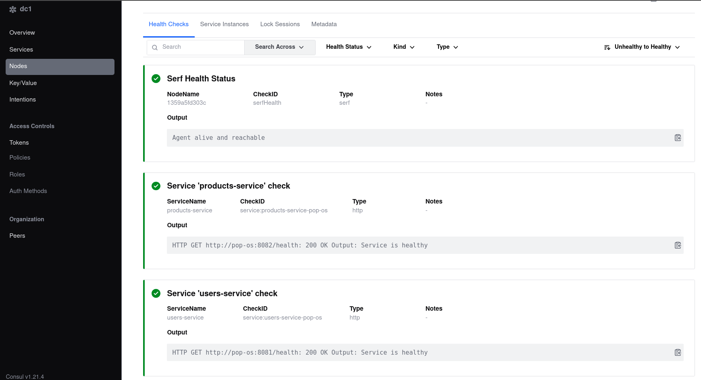
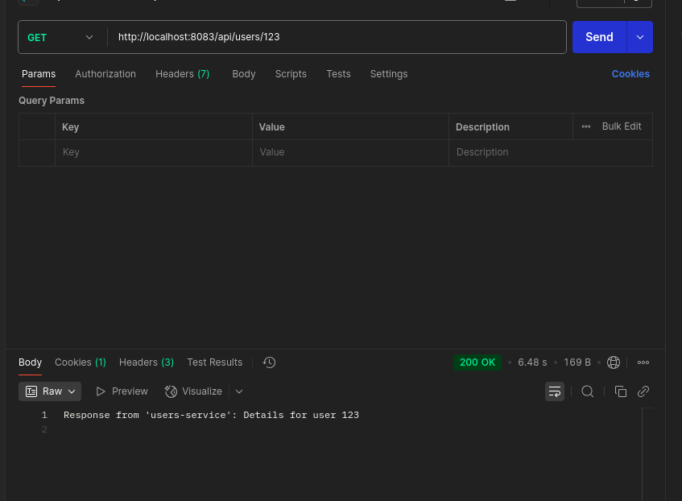
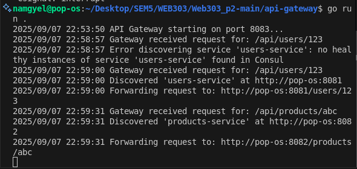

# Practical 2 Report: API Gateway with Service Discovery

## Introduction

This report details the implementation of Practical 2 for the WEB303 Microservices & Serverless Applications module. The practical involved building a microservices ecosystem consisting of an API Gateway, two independent services (Users Service and Products Service), and integrating service discovery using HashiCorp Consul. The goal was to demonstrate dynamic routing, service registration, and resilience in a decoupled architecture.

The system architecture includes:
- **API Gateway**: Acts as the single entry point, routing requests to appropriate services based on URL paths.
- **Users Service**: Handles user-related requests on port 8081.
- **Products Service**: Handles product-related requests on port 8082.
- **Consul**: Provides service discovery and health monitoring.

## Objectives

The primary objectives of this practical were to:
1. Implement microservices that register themselves with a service registry.
2. Build an API Gateway that dynamically discovers and routes to services.
3. Demonstrate resilience by showing how services can be restarted without reconfiguration.
4. Understand the benefits of decoupled architectures in microservices.

## Project Setup

The project was structured as follows:
```
Web303_p2-main/
├── api-gateway/
│   ├── main.go
│   └── go.mod
├── services/
│   ├── users-service/
│   │   ├── main.go
│   │   └── go.mod
│   └── products-service/
│       ├── main.go
│       └── go.mod
└── README.md
```

### Prerequisites Installation
- Go 1.18+ was installed and verified.
- Docker was set up for running Consul in development mode.
- Required Go libraries (Chi Router, Consul API) were added via `go get`.

## Implementation

### 1. Service Registry Setup
Consul was initially run using Docker:
```bash
docker run -d -p 8500:8500 --name=consul hashicorp/consul agent -dev -ui -client=0.0.0.0
```
The Consul UI was accessible at `http://localhost:8500` for monitoring service health.

### 2. Users Service
The Users Service was implemented with the following key features:
- **Service Registration**: Registers with Consul on startup using the service name "users-service".
- **Health Checks**: Provides a `/health` endpoint for Consul monitoring.
- **API Endpoint**: Handles GET requests to `/users/{id}`.
- **Port**: Runs on 8081.

Key code snippet for registration:
```go
registration := &consulapi.AgentServiceRegistration{
    ID:      fmt.Sprintf("%s-%s", serviceName, hostname),
    Name:    serviceName,
    Port:    servicePort,
    Address: hostname,
    Check: &consulapi.AgentServiceCheck{
        HTTP:     fmt.Sprintf("http://%s:%d/health", hostname, servicePort),
        Interval: "10s",
        Timeout:  "1s",
    },
}
```

### 3. Products Service
Similar to the Users Service, with modifications:
- **Service Name**: "products-service"
- **Port**: 8082
- **API Endpoint**: `/products/{id}`

### 4. API Gateway
The API Gateway serves as a reverse proxy with dynamic routing:
- **Routing Logic**: Parses URL paths to determine target service (e.g., `/api/users/*` → users-service).
- **Service Discovery**: Queries Consul for healthy service instances.
- **Request Forwarding**: Uses `httputil.NewSingleHostReverseProxy` to forward requests.
- **URL Rewriting**: Strips `/api/<service>` prefix before forwarding.

Key routing function:
```go
func routeRequest(w http.ResponseWriter, r *http.Request) {
    pathSegments := strings.Split(strings.TrimPrefix(r.URL.Path, "/"), "/")
    serviceName := pathSegments[1] + "-service"
    
    serviceURL, err := discoverService(serviceName)
    if err != nil {
        http.Error(w, err.Error(), http.StatusServiceUnavailable)
        return
    }
    
    proxy := httputil.NewSingleHostReverseProxy(serviceURL)
    r.URL.Path = "/" + strings.Join(pathSegments[1:], "/")
    proxy.ServeHTTP(w, r)
}
```

## Challenges Faced and Solutions

### Challenge 1: Port Conflicts
**Problem**: Initial attempts to start the API Gateway on port 8080 failed with "address already in use" error. Similarly, port 8081 was occupied by the Users Service.

**Solution**: Modified the API Gateway's port configuration from 8080 to 8083 in `main.go`:
```go
const gatewayPort = 8083
```
This ensured no conflicts with existing services.

### Challenge 2: Service Discovery Issues
**Problem**: When testing the API Gateway, requests to `http://localhost:8080/api/users/123` returned an authentication redirect HTML instead of the expected service response. This indicated that a different application was running on port 8080.

**Solution**: 
1. Verified that the API Gateway was configured to run on port 8083.
2. Ensured all services were properly registered with Consul.
3. Tested requests to the correct port: `http://localhost:8083/api/users/123`
4. Confirmed that the services were running and healthy in the Consul UI.

### Challenge 3: Consul Networking
**Problem**: As noted in the practical documentation, services running on the host machine could not be reached by the API Gateway when Consul was containerized, due to network isolation.

**Solution**: For this development setup, we proceeded with host-based services and Consul in Docker, ensuring all components were on the same network segment. In a production environment, containerizing all services with Docker Compose would resolve this issue.

## Testing and Results

### Service Registration Verification
- Consul UI showed both users-service and products-service registered and healthy.
- Health checks were passing every 10 seconds.

### API Testing
Successful test results:
```bash
# Users Service
curl http://localhost:8083/api/users/123
# Response: Response from 'users-service': Details for user 123

# Products Service  
curl http://localhost:8083/api/products/abc
# Response: Response from 'products-service': Details for product abc
```

### Resilience Demonstration
- Stopped the users-service: API Gateway correctly returned "no healthy instances" error.
- Restarted the service: Automatic re-registration occurred, and requests resumed working without gateway reconfiguration.

## Implementation Evidence

### 1. Consul UI - Service Registration & Health Status

The Consul UI displaying both services registered and healthy, confirming successful service discovery setup.



### 2. API Testing with Postman

Postman cURL requests demonstrating successful communication with both services through the API Gateway.



### 3. API Gateway Terminal Logs

API Gateway terminal output showing successful request routing to the relevant microservices.




## Technologies Used

- **Consul** - Service Discovery & Health Monitoring
- **API Gateway** - Request Routing & Load Balancing
- **Microservices Architecture**
- **RESTful APIs**

## Conclusion

This practical successfully demonstrated the implementation of a microservices architecture with API Gateway and service discovery. Key learnings include:

- **Decoupling Benefits**: Services can be updated independently without affecting others.
- **Dynamic Discovery**: Eliminates hard-coded service locations.
- **Resilience**: System gracefully handles service failures and recoveries.
- **Scalability**: New services can be added by following the registration pattern.

Challenges such as port conflicts and networking issues were resolved through configuration changes and proper testing. The implementation aligns with module learning outcomes related to microservices design and observability.

## References

- HashiCorp Consul Documentation
- Go Chi Router Documentation
- WEB303 Module Practical 2 Guidelines
