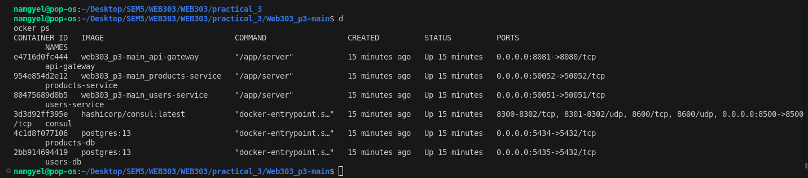
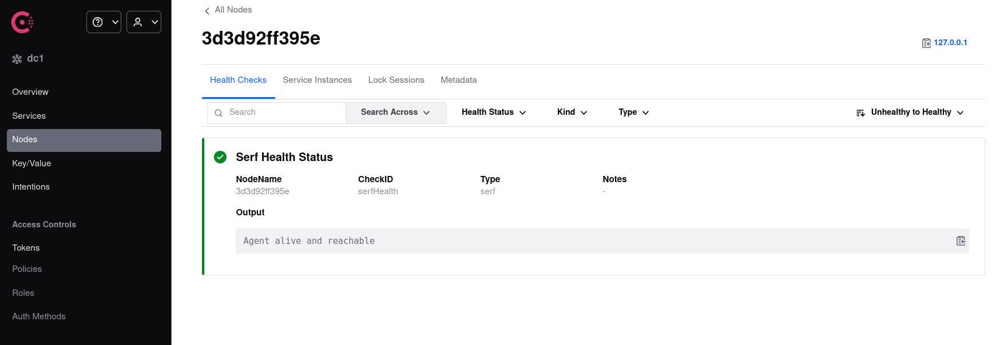
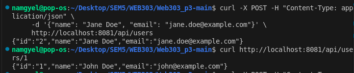
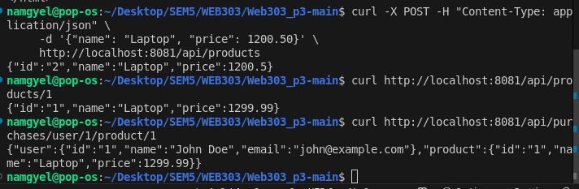

# Practical 3 Report: Full-Stack Microservices with gRPC, Databases, and Service Discovery

## Implementation Screenshots

### 1. Docker Services - All Running

### 2. Consul Service Discovery

### 3. API Testing - CRUD Operations
### Create a new user
### Retrieve the user

### Create a new product
### Retrieve the product

### Retrieve the combined purchase data

## Introduction

This report documents the design, implementation, and challenges addressed in building a microservices ecosystem for WEB303 Practical 3. The system consists of two independent microservices (Users and Products), each with its own PostgreSQL database, a Consul service registry for service discovery, and an API Gateway that aggregates and exposes HTTP endpoints. The architecture demonstrates scalable, decoupled, and resilient microservice patterns using gRPC for inter-service communication.

## System Architecture Overview

- **API Gateway**: Serves as the single entry point, translating HTTP requests into gRPC calls and aggregating data from multiple services.
- **Service Discovery (Consul)**: Enables dynamic discovery of service locations, decoupling service endpoints.
- **Microservices**: `users-service` and `products-service`, each managing its own data and exposing gRPC APIs.
- **Databases**: Each service uses a dedicated PostgreSQL instance for data isolation.

## Implementation Summary

1. **Project Setup**: Established a modular directory structure, defined Protocol Buffers for service contracts, and generated Go gRPC code.
2. **Service Development**: Implemented both services with GORM ORM, PostgreSQL integration, and Consul registration.
3. **API Gateway**: Developed an HTTP server that discovers services via Consul and aggregates responses for composite endpoints.
4. **Orchestration**: Used Docker Compose to manage all containers, including Consul and databases.

## Challenges and Solutions

### 1. Proto File Build Issues
**Challenge**: Docker build context isolation caused import path errors for generated proto files, as services could not access files outside their context.
**Solution**: Proto files and generated code were copied into each service's build context, ensuring all dependencies were available during Docker builds. This eliminated import path and build errors.

### 2. Hardcoded Service Endpoints in API Gateway
**Challenge**: The API Gateway initially used hardcoded hostnames and ports to connect to services, reducing flexibility and resilience.
**Solution**: Integrated Consul service discovery in the API Gateway, allowing it to dynamically resolve service addresses at runtime. This decouples the gateway from static endpoints and supports scaling and failover.

### 3. Composite Endpoint Aggregation
**Challenge**: The endpoint for aggregating user and product data was not robust, with direct calls and poor error handling.
**Solution**: Refactored the composite endpoint to use proper service discovery and parallel gRPC calls, with improved error handling and response aggregation. This ensures reliable and efficient data retrieval from multiple services.

### 4. Docker Networking and Build Consistency
**Challenge**: Ensuring all services could communicate reliably within Docker Compose, and that builds were reproducible.
**Solution**: Standardized Dockerfiles, used multi-stage builds, and configured Docker Compose networks to ensure seamless inter-service communication and consistent builds.

## Testing and Validation

- **Consul UI**: Verified service registration and health at `http://localhost:8500`.
- **API Endpoints**: Used cURL/Postman to test user/product creation, retrieval, and composite endpoints.
- **Sample Requests**:
  - Create User: `POST /api/users`
  - Get User: `GET /api/users/{id}`
  - Create Product: `POST /api/products`
  - Get Product: `GET /api/products/{id}`
  - Aggregate: `GET /api/purchases/user/{userId}/product/{productId}`

## Conclusion

This practical successfully demonstrates a robust microservices architecture with dynamic service discovery, isolated data management, and an API Gateway capable of aggregating data from multiple services. Key challenges around build context, service discovery, and endpoint aggregation were identified and resolved, resulting in a scalable and maintainable system suitable for real-world deployment.

---

*Prepared by: [Your Name]*
*Date: [Submission Date]*
