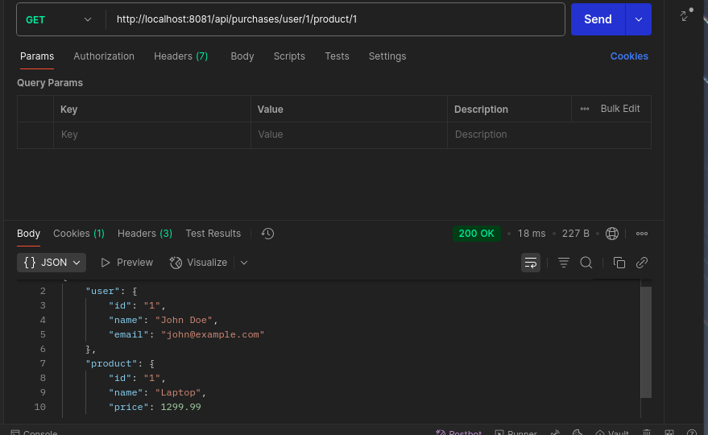

# Practical 3 Report: Full-Stack Microservices with gRPC, Databases, and Service Discovery

## Objective

Build a microservices ecosystem with gRPC communication, PostgreSQL databases, and Consul service discovery. The system includes two independent services (Users and Products), an API Gateway for HTTP-to-gRPC translation, and demonstrates service discovery and data aggregation patterns.

**Learning Outcomes:**
- Implement microservices using gRPC and Protocol Buffers
- Configure service discovery with Consul
- Build an API Gateway to aggregate data from multiple services
- Manage distributed data with isolated databases per service

## Requirements & Setup

### Tools and Technologies

- Go 1.21+, gRPC, Protocol Buffers
- PostgreSQL 13, GORM
- Consul (Service Discovery)
- Docker & Docker Compose
- Gorilla Mux (HTTP routing)

### Environment Setup

**Install Protocol Buffers:**

```bash
go install google.golang.org/protobuf/cmd/protoc-gen-go@v1.28
go install google.golang.org/grpc/cmd/protoc-gen-go-grpc@v1.2
export PATH="$PATH:$(go env GOPATH)/bin"
```

**Generate Proto Code:**

```bash
protoc --go_out=./proto/gen --go_opt=paths=source_relative \
    --go-grpc_out=./proto/gen --go-grpc_opt=paths=source_relative \
    proto/*.proto
```

## Implementation

### Step 1: Define Service Contracts

Created proto files for users and products services:

**proto/users.proto:**
```protobuf
syntax = "proto3";
option go_package = "./proto/gen;gen";

service UserService {
  rpc CreateUser(CreateUserRequest) returns (UserResponse);
  rpc GetUser(GetUserRequest) returns (UserResponse);
}
```

**proto/products.proto:**
```protobuf
syntax = "proto3";
option go_package = "./proto/gen;gen";

service ProductService {
  rpc CreateProduct(CreateProductRequest) returns (ProductResponse);
  rpc GetProduct(GetProductRequest) returns (ProductResponse);
}
```

### Step 2: Implement Microservices

Both services follow the same pattern:
- GORM models with PostgreSQL
- gRPC server implementation
- Consul service registration
- Dockerized deployment

**Key code (users-service):**
```go
func (s *server) CreateUser(ctx context.Context, req *pb.CreateUserRequest) (*pb.UserResponse, error) {
    user := User{Name: req.Name, Email: req.Email}
    if err := s.db.Create(&user).Error; err != nil {
        return nil, err
    }
    return &pb.UserResponse{User: &pb.User{Id: fmt.Sprint(user.ID), Name: user.Name, Email: user.Email}}, nil
}
```

### Step 3: API Gateway with Service Discovery

Implemented dynamic service discovery using Consul:

```go
func (sd *ServiceDiscovery) getServiceConnection(serviceName string) (*grpc.ClientConn, error) {
    services, _, err := sd.consul.Health().Service(serviceName, "", true, nil)
    if err != nil || len(services) == 0 {
        return nil, fmt.Errorf("service %s not found", serviceName)
    }
    address := fmt.Sprintf("%s:%d", services[0].Service.Address, services[0].Service.Port)
    return grpc.Dial(address, grpc.WithInsecure())
}
```

**Composite endpoint for data aggregation:**
```go
func getPurchaseDataHandler(w http.ResponseWriter, r *http.Request) {
    // Fetch user and product data in parallel using goroutines
    // Aggregate results and return combined JSON response
}
```

### Step 4: Docker Orchestration

Configured Docker Compose with all services, databases, and Consul.

## Results & Testing

### Docker Services Status


All containers running successfully.

### Consul Service Discovery


Both services registered and healthy in Consul.

### Test Results

**User Operations:**


- Create User: `POST /api/users` - PASS
- Get User: `GET /api/users/{id}` - PASS

**Product Operations:**


- Create Product: `POST /api/products` - PASS
- Get Product: `GET /api/products/{id}` - PASS

**Composite Endpoint:**


- Aggregate Data: `GET /api/purchases/user/{userId}/product/{productId}` - PASS

All tests passed. The system successfully demonstrates:
- Service isolation with separate databases
- Dynamic service discovery via Consul
- HTTP-to-gRPC translation
- Parallel data aggregation from multiple services

## Reflection

### Key Learnings

- Microservices architecture with complete service isolation
- gRPC for efficient inter-service communication
- Dynamic service discovery eliminates hardcoded endpoints
- API Gateway pattern for unified client interface
- Database-per-service ensures independence

### Challenges and Solutions

**1. Proto File Build Issues**
- Problem: Docker build context couldn't access root proto files
- Solution: Copied proto files into each service's build context

**2. Hardcoded Service Endpoints**
- Problem: API Gateway used static hostnames instead of Consul
- Solution: Implemented dynamic service discovery with connection caching

**3. Composite Endpoint**
- Problem: Sequential calls and poor error handling
- Solution: Parallel goroutines with proper synchronization and error handling

### Improvements

- Add health checks and circuit breakers
- Implement authentication/authorization
- Add distributed tracing and centralized logging
- Use Consul for configuration management
- Implement API versioning

## Conclusion

Successfully implemented a microservices architecture with:
- Two independent services with isolated databases
- Dynamic service discovery using Consul
- API Gateway for HTTP-to-gRPC translation and data aggregation
- Containerized deployment with Docker Compose

All challenges were resolved, resulting in a scalable system demonstrating key microservices patterns and best practices.

## References

1. gRPC Documentation - https://grpc.io/docs/
2. Protocol Buffers Guide - https://developers.google.com/protocol-buffers/docs/proto3
3. Consul Documentation - https://www.consul.io/docs
4. GORM Documentation - https://gorm.io/docs/
5. Docker Compose Documentation - https://docs.docker.com/compose/
