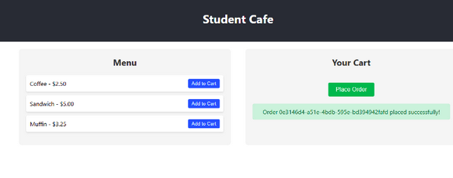
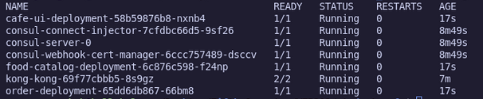
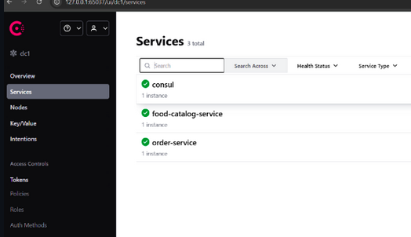
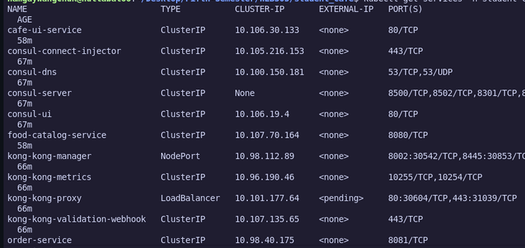

# WEB303 Practical 4 Report

## Objective

This practical demonstrates the deployment of a microservices-based student cafe ordering application using Kubernetes. The main goal was to build and deploy Go-based microservices with Kong API Gateway for routing and Consul for service discovery.

Learning outcomes include deploying applications on Kubernetes, configuring API gateways, implementing service discovery, and debugging distributed systems.

## Requirements & Setup

### Tools and Technologies

| Technology | Purpose |
|------------|---------|
| Go | Backend microservices |
| React | Frontend UI |
| Docker | Containerization |
| Minikube | Local Kubernetes cluster |
| kubectl | Kubernetes management |
| Helm | Package management |
| Consul | Service discovery |
| Kong | API Gateway |

### Environment Setup

Initialize Minikube cluster:
```bash
minikube start --cpus 2 --memory 4096
eval $(minikube -p minikube docker-env)
```

Create namespace:
```bash
kubectl create namespace student-cafe
```

Install Consul and Kong via Helm:
```bash
helm repo add hashicorp https://helm.releases.hashicorp.com
helm repo add kong https://charts.konghq.com
helm install consul hashicorp/consul --set global.name=consul --namespace student-cafe --set server.replicas=1 --set server.bootstrapExpect=1
helm install kong kong/kong --namespace student-cafe
```

## Implementation

### System Architecture

The application consists of three main components: a React frontend, a food catalog service, and an order service. Kong Gateway routes incoming requests to the appropriate service based on URL paths. Consul handles service discovery allowing microservices to locate each other.

Request flow: Browser sends requests to Kong Gateway which routes to either the frontend (path /), catalog service (path /api/catalog), or order service (path /api/orders).

### Food Catalog Service

This Go service provides a list of available menu items. It uses the Chi router and registers itself with Consul for service discovery.

Main features:
- Exposes /items endpoint returning JSON list of food items
- Registers with Consul at consul-server:8500
- Provides health check endpoint at /health
- Runs on port 8080

The Dockerfile uses multi-stage builds to create a minimal Alpine-based image.

### Order Service

This Go service handles order creation and storage. Orders are stored in memory with unique IDs generated using UUID.

Main features:
- Accepts POST requests at /orders endpoint
- Discovers catalog service via Consul
- Generates unique order IDs
- Returns order confirmation with status
- Runs on port 8081

### React Frontend

The React application provides a user interface for browsing menu items and placing orders.

Features:
- Displays menu items fetched from /api/catalog/items
- Shopping cart functionality
- Order submission to /api/orders/orders
- Error handling and loading states

The application is built and served using Nginx in a containerized environment.

### Kubernetes Configuration

app-deployment.yaml contains:
- Deployments for all three services
- ClusterIP Services for internal communication
- Environment variables for Consul configuration
- Image pull policy set to IfNotPresent for local images

kong-ingress.yaml configures routing:
- /api/catalog routes to food-catalog-service on port 8080
- /api/orders routes to order-service on port 8081
- / routes to cafe-ui-service on port 80

### Deployment Process

Build Docker images:
```bash
docker build -t food-catalog-service:v1 ./food-catalog-service
docker build -t order-service:v1 ./order-service
docker build -t cafe-ui:v1 ./cafe-ui
```

Deploy to Kubernetes:
```bash
kubectl apply -f app-deployment.yaml
kubectl apply -f kong-ingress.yaml
```

Verify deployment:
```bash
kubectl get pods -n student-cafe
kubectl get services -n student-cafe
```

## Results & Testing

### Issue Resolution

Problem: Order submission was failing when testing the application.

Investigation steps:
- Checked pod logs using kubectl logs
- Verified service endpoints
- Tested API endpoints directly with curl

Root cause: Services registered with Consul using pod-specific addresses that were not consistently resolvable within Kubernetes DNS.

Solution: Modified service registration to use Kubernetes service DNS names and added fallback logic. Rebuilt images as v2 and performed rolling updates.

```bash
docker build -t food-catalog-service:v2 ./food-catalog-service
docker build -t order-service:v2 ./order-service
kubectl set image deployment/food-catalog-deployment food-catalog-service=food-catalog-service:v2 -n student-cafe
kubectl set image deployment/order-deployment order-service=order-service:v2 -n student-cafe
```

### Test Results

Test 1: Retrieve menu items
```bash
curl http://localhost:8888/api/catalog/items
```
Result: PASS - Returns JSON array of food items

Test 2: Create order
```bash
curl -X POST http://localhost:8888/api/orders/orders -H "Content-Type: application/json" -d '{"item_ids":["1","2"]}'
```
Result: PASS - Returns order object with generated ID and status

Test 3: Frontend functionality
Result: PASS - Successfully displays menu, manages cart, and submits orders

Test 4: Pod health
```bash
kubectl get pods -n student-cafe
```
Result: PASS - All pods running with 1/1 ready status

### Screenshots

1. Food menu and successful order placement
  

2. Kubernetes Pods status
   

3. Kong Gateway URL
   

4. Services overview
   

## Reflection

### Key Learnings

Working with Kubernetes provided hands-on experience with container orchestration. Understanding how Deployments, Services, and Ingress work together helped clarify microservices architecture patterns.

Service discovery is crucial in distributed systems. This practical showed both Consul-based discovery and Kubernetes native DNS resolution, demonstrating that multiple mechanisms can coexist.

Kong API Gateway simplifies routing and provides a single entry point for clients. The strip-path annotation and path-based routing enabled clean URL structure.

Docker multi-stage builds reduce image sizes significantly. Using Alpine-based images and the IfNotPresent pull policy are important for local development.

### Challenges and Solutions

Challenge 1: Order submission initially failed.
Solution: Debugged using pod logs and curl commands. Fixed by updating Consul registration to use Kubernetes service names instead of pod-specific addresses.

Challenge 2: Kubernetes could not find locally built images.
Solution: Set Docker context to Minikube daemon using eval $(minikube docker-env) before building images.

Challenge 3: Kong Ingress routing was not working correctly.
Solution: Added explicit port numbers in the backend service definitions within the Ingress manifest.

### Possible Improvements

The current implementation stores orders in memory. Adding a database with PersistentVolumes would make the system stateful and production-ready.

Implementing Horizontal Pod Autoscaling would allow services to scale based on CPU or memory usage.

Adding monitoring with Prometheus and Grafana would provide better visibility into system performance.

Security could be improved by implementing authentication, rate limiting, and Network Policies.

## Conclusion

This practical successfully demonstrated deploying a microservices application on Kubernetes. The student cafe system included a React frontend, two Go microservices, Consul for service discovery, and Kong for API gateway functionality.

The main achievement was identifying and fixing the order submission issue through systematic debugging. This reinforced understanding of Kubernetes networking and service discovery mechanisms.

Key takeaways:
- Kubernetes simplifies container orchestration
- API gateways centralize routing logic
- Service discovery enables dynamic microservices communication
- Debugging distributed systems requires understanding multiple layers
- Containerization ensures consistency across environments

## References

1. Kubernetes Official Documentation - https://kubernetes.io/docs/
2. Kong Gateway Documentation - https://docs.konghq.com/gateway/
3. HashiCorp Consul Documentation - https://developer.hashicorp.com/consul/docs
4. Go Chi Router - https://github.com/go-chi/chi
5. Docker Multi-stage Builds - https://docs.docker.com/build/building/multi-stage/
6. Helm Documentation - https://helm.sh/docs/

## Appendix

### Project Structure
```
student-cafe/
├── app-deployment.yaml
├── kong-ingress.yaml
├── cafe-ui/
│   ├── Dockerfile
│   ├── package.json
│   └── src/
├── food-catalog-service/
│   ├── Dockerfile
│   ├── go.mod
│   └── main.go
└── order-service/
    ├── Dockerfile
    ├── go.mod
    └── main.go
```

### Deliverables
- Complete project source code
- Kubernetes deployment manifests
- Kong ingress configuration
- Dockerfiles for all services
- Go module files
- React application
- Documentation with screenshots
- Working order submission functionality

