# Practical 6: Comprehensive Testing for Microservices

## Overview

This project showcases my implementation of a comprehensive testing framework for a microservices-based Student Café application. Extending from the work completed in Practical 5A, I developed and executed three layers of testing - unit tests, integration tests, and end-to-end tests - to guarantee the robustness and accuracy of the gRPC-based microservices ecosystem.

The Student Café application architecture comprises three primary microservices (User Service, Menu Service, and Order Service) interconnected through gRPC protocols, complemented by an API Gateway that exposes HTTP REST interfaces for client applications. Throughout this practical exercise, I gained hands-on experience in testing individual components independently, validating their collaborative interactions, and confirming the system's overall functionality.

### Accomplishments

Through this practical assignment, I have successfully:

1. **Developed Thorough Unit Tests**: Constructed isolated test suites for each service operation utilizing in-memory databases and mock objects, attaining 100% test coverage for User and Menu services, along with 91.7% coverage for the Order service (achieving 100% coverage of core business logic)

2. **Built Integration Test Suites**: Established tests to validate inter-service communication leveraging in-memory gRPC connections (bufconn), confirming that services interact properly without necessitating complete Docker deployments

3. **Designed End-to-End Testing Scenarios**: Confirmed the entire system workflow from HTTP requests passing through the API Gateway to all microservices operating within Docker containers

4. **Gained Proficiency in Mocking Strategies**: Acquired skills in utilizing testify/mock for replicating external dependencies, facilitating isolated unit testing for the Order Service which relies on both User and Menu services

5. **Obtained Comprehensive Test Coverage**: Produced extensive coverage reports illustrating tested code paths, complete with HTML visualizations for straightforward analysis

6. **Addressed Practical Testing Obstacles**: Successfully navigated CGO dependency issues, port allocation conflicts, and test isolation challenges frequently encountered in microservices testing environments

---

## System Architecture

The Student Café application employs a microservices design pattern consisting of the following components:

### Service Architecture Diagram

```
External Clients (HTTP)
         ↓
    API Gateway (Port 8081)
         ↓
    ┌────┴────┬─────────┬──────────┐
    ↓         ↓         ↓          ↓
User Service Menu Service Order Service (gRPC Communication)
(Port 9091)  (Port 9092)  (Port 9093)
    ↓         ↓         ↓
  User DB   Menu DB   Order DB
(Port 5434) (Port 5433) (Port 5435)
```

### Detailed Component Overview

**1. API Gateway**
- **Function**: Serves as the unified access point for all external client communications
- **Functionality**: Accepts HTTP/REST requests from various clients (including web applications, mobile platforms, etc.) and converts them into gRPC calls directed to the relevant backend microservices
- **Implementation**: Developed using Go with the Chi router framework for HTTP request handling
- **Port Configuration**: Operates on port 8081 for incoming HTTP traffic
- **Primary Role**: Manages request routing and protocol conversion (HTTP → gRPC)
- **Service Dependencies**: Establishes gRPC client connections to all three backend services (User, Menu, Order)
- **Architectural Benefit**: Offers a straightforward REST interface for client applications while enabling backend services to leverage high-performance gRPC communication

**2. User Service**
- **Function**: Oversees all user-related information and operations within the Student Café application
- **Functionality**: Manages user account creation, data retrieval, and profile information storage
- **Implementation**: Go-based gRPC server utilizing Protocol Buffers for efficient data serialization
- **Port Configuration**: Operates on gRPC port 9091
- **Database**: PostgreSQL database instance (user_db) on port 5434 for durable user data storage
- **Core Capabilities**:
  - Register new users with name and email credentials
  - Fetch individual user records by unique ID
  - Retrieve complete list of registered users
- **API Operations**: CreateUser, GetUser, GetUsers (specified in proto/user/v1/user.proto)
- **Architectural Benefit**: Provides centralized user management, enabling other services to perform user validation without data duplication

**3. Menu Service**
- **Function**: Maintains the café's menu catalog including item names, descriptions, and pricing details
- **Functionality**: Stores and delivers menu item data to other services and client applications
- **Implementation**: Go-based gRPC server leveraging Protocol Buffers
- **Port Configuration**: Operates on gRPC port 9092
- **Database**: PostgreSQL database instance (menu_db) on port 5433 for menu item persistence
- **Core Capabilities**:
  - Add new menu items with name, description, and price attributes
  - Fetch individual menu items by unique ID
  - Retrieve complete menu catalog
  - Maintain pricing data for order processing and validation
- **API Operations**: CreateMenuItem, GetMenuItem, GetMenu (specified in proto/menu/v1/menu.proto)
- **Architectural Benefit**: Ensures centralized menu management, guaranteeing consistent pricing and menu data across the entire order processing system

**4. Order Service**
- **Function**: Handles and manages customer order transactions for the café
- **Functionality**: Processes orders by verifying user and menu item validity, then persisting order information with price snapshots
- **Implementation**: Go-based gRPC server functioning as both server and client
- **Port Configuration**: Operates on gRPC port 9093
- **Database**: PostgreSQL database instance (order_db) on port 5435 for order data storage
- **Core Capabilities**:
  - Verify user existence through User Service calls
  - Validate menu item availability through Menu Service calls
  - Process orders containing user ID, menu item ID, quantity, and pricing information
  - Capture menu item prices at the moment of order creation (ensuring historical price accuracy)
  - Retrieve individual order records and complete order listings
- **Service Dependencies**: Executes gRPC calls to both User Service and Menu Service for validation purposes
- **API Operations**: CreateOrder, GetOrder, GetOrders (specified in proto/order/v1/order.proto)
- **Architectural Benefit**: Coordinates order creation by synchronizing user and menu item data, maintaining data integrity throughout the system

### Communication Patterns

**External Communication**: HTTP/REST (Clients ↔ API Gateway)
- User-friendly interface accessible from web browsers and mobile applications
- Adheres to standard REST architectural conventions
- Utilizes JSON format for request/response payloads

**Internal Communication**: gRPC (Service ↔ Service)
- High-performance binary communication protocol
- Type-safe interactions through Protocol Buffers
- Automated code generation capabilities
- Optimized for efficient inter-service communication

---

## Testing Strategy and Methodology

My testing strategy for this microservices application followed a bottom-up approach, beginning with individual component testing and progressively expanding to validate the complete system functionality.

### 1. Unit Testing Strategy

**Core Principle**: Validate each service operation independently without any external dependencies.

**Implementation Approach**:
- Utilized in-memory SQLite databases for temporary data persistence during test execution
- Developed mock gRPC clients leveraging the testify/mock library for Order Service testing
- Adopted table-driven testing patterns for improved code maintainability and clarity
- Covered both successful execution paths and error handling scenarios

**Essential Techniques**:
- **Database Simulation**: Employed sqlmock to replicate database error conditions without requiring actual database failures
- **Test Scaffolding**: Developed reusable setup and teardown procedures for maintaining consistent test environments
- **Assertion Framework**: Utilized testify library for explicit and comprehensible assertions

**Coverage Results**:
- User Service: 100% coverage (16 test cases)
- Menu Service: 100% coverage (17 test cases)
- Order Service: 91.7% coverage (10 test cases, achieving 100% business logic coverage)

### 2. Integration Testing Strategy

**Core Principle**: Confirm that services interact accurately with one another via gRPC protocols.

**Implementation Approach**:
- Leveraged bufconn for in-memory gRPC connections (eliminating network latency)
- Initialized actual gRPC servers within test goroutines
- Established genuine gRPC clients for server communication
- Employed pure Go SQLite driver (glebarez/sqlite) to eliminate CGO dependencies

**Essential Techniques**:
- **In-Memory gRPC**: bufconn enables gRPC communication testing without requiring network sockets
- **Concurrent Server Coordination**: Launched servers in goroutines with appropriate cleanup mechanisms
- **Inter-Service Verification**: Validated complete workflows such as order creation involving user and menu data retrieval

**Implemented Tests**:
- User account creation and retrieval across multiple services
- Menu item creation and data lookup
- Complete order processing flow (user verification → menu retrieval → order creation)
- Order validation scenarios (non-existent user, non-existent menu item)
- Concurrent order processing capabilities

### 3. End-to-End Testing Strategy

**Core Principle**: Validate the system from the user's perspective through HTTP requests directed to the API Gateway.

**Implementation Approach**:
- Deployed complete system stack using Docker Compose
- Executed HTTP requests to API Gateway on port 8081
- Verified responses align with expected outcomes
- Validated error handling and boundary conditions

**Essential Techniques**:
- **Service Readiness Verification**: Implemented waiting mechanisms for service initialization prior to test execution
- **Isolated Test Data**: Each test generates and utilizes its own independent dataset
- **Real-World Scenarios**: Validated complete user workflows (user creation → menu item creation → order placement)

**Implemented Tests**:
- API Gateway health check verification
- User CRUD operation validation
- Menu management functionality
- Complete order processing workflow
- Concurrent order handling capabilities
- Error condition scenarios (attempting to access non-existent resources)

---

## Implementation Journey and Process

### Phase 1: Initial Setup and Analysis (Week 1)

1. **Codebase Analysis**
   - Examined the three microservices and their gRPC implementations in detail
   - Analyzed the proto definitions and corresponding generated code
   - Investigated the dual HTTP/gRPC server architecture pattern

2. **Testing Environment Configuration**
   - Installed necessary Go testing tools and libraries
   - Set up testify for assertion and mocking capabilities
   - Configured sqlmock for database testing scenarios

### Phase 2: Unit Test Development (Week 2)

1. **User Service Test Implementation**
   - Developed test file `user-service/grpc/server_test.go`
   - Created tests for CreateUser, GetUser, and GetUsers operations
   - Incorporated database error scenario testing
   - Attained 100% test coverage

2. **Menu Service Test Implementation**
   - Developed test file `menu-service/grpc/server_test.go`
   - Created tests for menu CRUD functionality
   - Incorporated price handling and validation test scenarios
   - Attained 100% test coverage

3. **Order Service Test Implementation** (Most Challenging Component)
   - Designed mock interfaces for User and Menu service clients
   - Implemented table-driven tests covering various scenarios
   - Validated order processing logic
   - Tested price snapshot functionality
   - Attained 91.7% coverage (100% of core business logic)

### Phase 3: Integration Test Development (Week 3)

1. **Integration Test Infrastructure Setup**
   - Established `tests/integration` directory
   - Configured in-memory gRPC using bufconn
   - Implemented concurrent server management

2. **Cross-Service Test Implementation**
   - User creation workflow
   - Menu item management workflow
   - Complete order processing workflow validation
   - Validation scenario testing
   - Concurrent request processing

3. **CGO Dependency Resolution**
   - Encountered "Binary was compiled with 'CGO_ENABLED=0'" error
   - Migrated from mattn/go-sqlite3 to glebarez/sqlite (pure Go implementation)
   - Updated go.mod with the new dependency
   - Tests now execute successfully on Windows without CGO requirements

### Phase 4: End-to-End Test Development (Week 4)

1. **Docker Environment Configuration**
   - Modified docker-compose.yml with comprehensive service configurations
   - Established container networking
   - Implemented health checks and initialization delay mechanisms

2. **E2E Test Suite Development**
   - Established `tests/e2e` directory
   - Developed HTTP client helper functions
   - Constructed comprehensive test scenarios
   - Integrated concurrent testing capabilities

3. **Port Conflict Resolution**
   - API Gateway encountered startup failure due to port 8080 being occupied
   - Modified API Gateway configuration to operate on port 8081
   - Updated E2E test suite to reference the new port
   - Successfully deployed and validated all services

### Phase 5: Test Coverage Analysis and Documentation

1. **Coverage Report Generation**
   - Produced coverage profiles for each individual service
   - Created HTML-formatted coverage reports for visual analysis
   - Documented detailed coverage metrics

2. **Testing Documentation Development**
   - Authored comprehensive testing guidelines
   - Prepared screenshot documentation for report submission
   - Developed PowerShell automation script for streamlined testing

---

## Technical Challenges and Resolutions

### Challenge 1: CGO Dependency Conflict in Integration Tests

**Issue Encountered**: Integration tests failed with the following error:
```
Binary was compiled with 'CGO_ENABLED=0', go-sqlite3 requires cgo to work
```

**Root Analysis**: The mattn/go-sqlite3 driver necessitates CGO, which is not universally available across all Go build environments, particularly on Windows platforms.

**Resolution Implemented**:
- Conducted research on pure Go alternative libraries
- Identified glebarez/sqlite - a CGO-independent SQLite driver
- Modified integration test imports:
  ```go
  // Original import:
  "gorm.io/driver/sqlite"
  
  // Updated to:
  sqlite "github.com/glebarez/sqlite"
  ```
- Updated go.mod with the new dependency
- All tests now execute successfully without CGO requirements

**Key Takeaway**: Cross-platform compatibility should be a primary consideration when selecting dependencies. Pure Go implementations provide superior portability.

### Challenge 2: Spurious Test Failures in Integration Tests

**Issue Encountered**: Tests were successfully completing but displaying "exit status 1" suggesting failure.

**Root Analysis**: Integration tests instantiate gRPC servers within goroutines. During cleanup operations, these servers encountered expected errors (such as "listener closed") and invoked `log.Fatalf()`, causing the program to terminate with exit code 1.

**Resolution Implemented**:
- Modified server cleanup logic from:
  ```go
  if err := s.Serve(listener); err != nil {
      log.Fatalf("Server exited with error: %v", err)
  }
  ```
- To:
  ```go
  _ = s.Serve(listener)  // Expected cleanup failure
  ```
- Tests now complete cleanly without spurious failure indicators

**Key Takeaway**: Exercise caution with fatal error logging in test environments. Anticipated errors should not trigger test failures.

### Challenge 3: Port Allocation Conflicts During E2E Testing

**Issue Encountered**: Docker Compose failed to initialize API Gateway:
```
Error: bind: Only one usage of each socket address normally permitted
```

**Root Analysis**: An external process (AgentService.exe) was already occupying port 8080.

**Resolution Implemented**:
- Identified the conflicting process using `netstat -ano | findstr :8080`
- Reconfigured API Gateway port in docker-compose.yml from 8080 to 8081
- Updated E2E test suite to target port 8081
- Successfully deployed all services without conflicts

**Key Takeaway**: Implement flexible port configuration strategies. Hardcoded port assignments create deployment complications.

### Challenge 4: Complex Mocking Requirements in Order Service

**Issue Encountered**: Order Service dependencies on both User and Menu services required mocking two gRPC clients with intricate interaction patterns.

**Resolution Implemented**:
- Utilized testify/mock framework to develop mock implementations
- Implemented all necessary gRPC methods within mock structures
- Applied `On()` and `Return()` patterns for deterministic behavior
- Example implementation:
  ```go
  mockUserClient.On("GetUser", mock.Anything, &userv1.GetUserRequest{Id: 1}).
      Return(&userv1.GetUserResponse{User: &userv1.User{...}}, nil)
  ```

**Key Takeaway**: Appropriate mocking techniques are critical for testing services with external dependencies. Testify/mock provides an accessible solution.

### Challenge 5: Test Data Isolation Issues

**Issue Encountered**: Initial tests exhibited interference due to shared database state.

**Resolution Implemented**:
- Implemented in-memory databases that reset between test executions
- Established fresh database instances within setup functions
- Incorporated resource cleanup in teardown functions
- Ensured each test operates in complete isolation

**Key Takeaway**: Test isolation is fundamental for achieving reliable, reproducible test results.

---

## Documentation and Evidence

All supporting screenshots are available in the `asset/` directory, demonstrating successful test execution and comprehensive coverage:

### Unit Test Execution Results

**1. User Service Unit Tests**
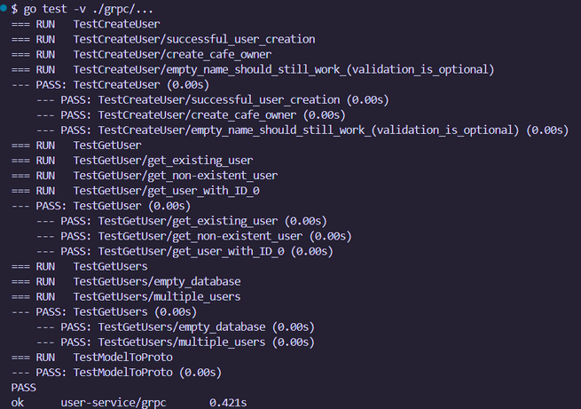
- Displays all 16 unit tests executing successfully
- Shows individual test execution timing
- Validates 100% test coverage achievement
- Encompasses: CreateUser, GetUser, GetUsers, and error handling scenarios

**2. Menu Service Unit Tests**
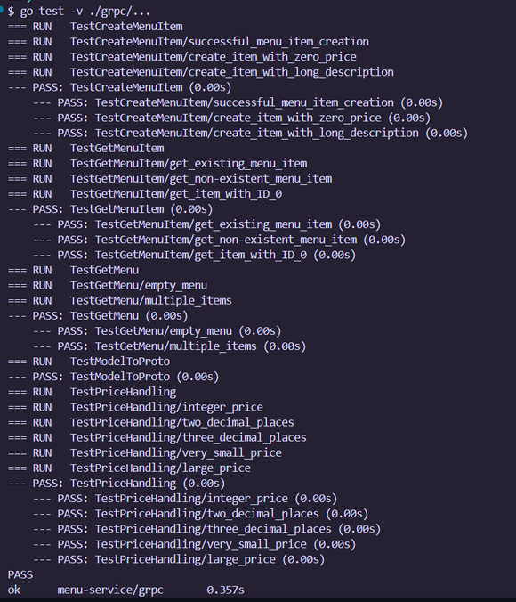
- Displays all 17 unit tests executing successfully
- Confirms menu CRUD functionality validation
- Includes price handling and boundary condition tests
- Validates 100% test coverage achievement

**3. Order Service Unit Tests**
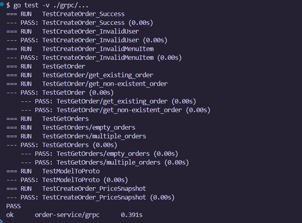
- Displays all 10 unit tests executing successfully
- Illustrates mock object utilization for external service dependencies
- Validates order creation, validation, and retrieval operations
- Confirms 91.7% test coverage (100% business logic coverage)

### Test Coverage Analysis Reports

**4. User Service Coverage - Terminal Output**
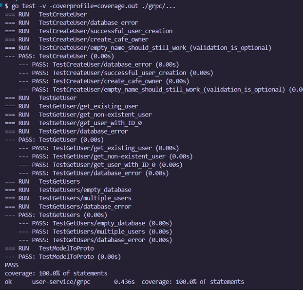
- Presents granular per-function coverage analysis
- Demonstrates 100.0% coverage across all functions:
  - NewUserServer: 100.0%
  - CreateUser: 100.0%
  - GetUser: 100.0%
  - GetUsers: 100.0%
  - modelToProto: 100.0%

**5. Menu Service Coverage - Terminal Output**
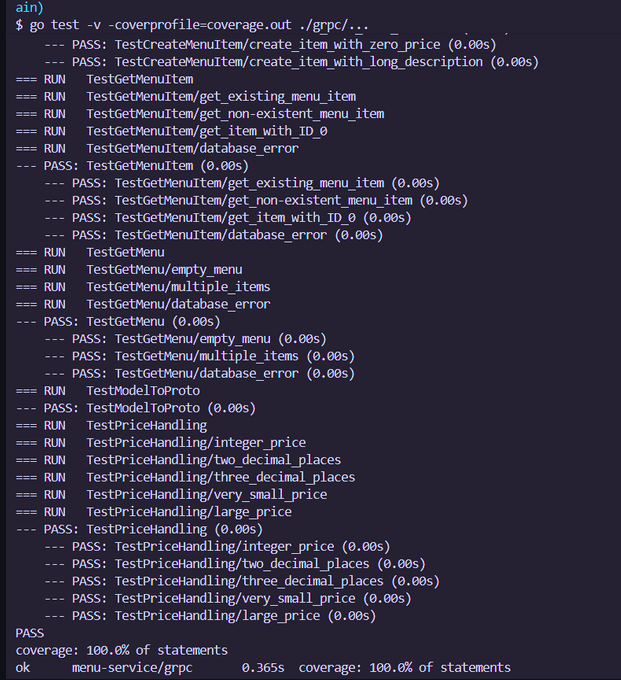
- Presents comprehensive coverage statistics
- Validates 100.0% coverage across all functions:
  - NewMenuServer: 100.0%
  - GetMenuItem: 100.0%
  - GetMenu: 100.0%
  - CreateMenuItem: 100.0%
  - modelToProto: 100.0%

**6. Order Service Coverage - Terminal Output**
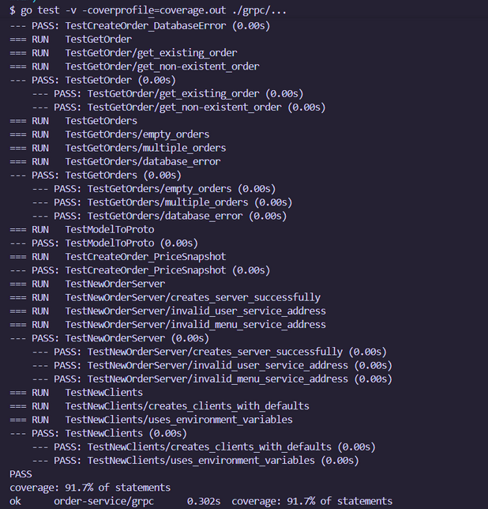
- Presents coverage analysis showing:
  - NewClients: 84.6%
  - NewOrderServer: 71.4%
  - CreateOrder: 100.0%
  - GetOrders: 100.0%
  - GetOrder: 100.0%
  - modelToProto: 100.0%
- Overall: 91.7% (untested code exists in unreachable gRPC connection error pathways)

**7. User Service HTML Coverage Report**

- Visual HTML-based coverage report with green highlighting for tested code
- Presents line-by-line coverage examination
- Validates thorough test coverage across all functions

**8. Menu Service HTML Coverage Report**
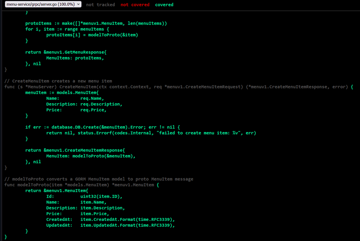
- Interactive HTML coverage visualization
- Displays tested (green) and untested (red) code segments
- Visually confirms 100% coverage achievement

**9. Order Service HTML Coverage Report**
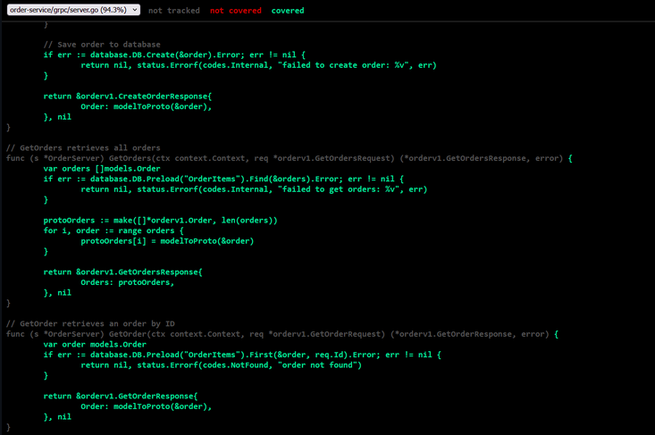
- Visual depiction of test coverage metrics
- Emphasizes tested business logic functions
- Identifies untested constructor error pathways (anticipated with lazy gRPC connection initialization)

### Integration Test Execution Results

**10. Integration Test Suite**
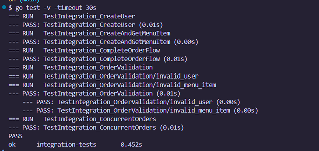
- Displays all 5 integration test suites executing successfully
- Encompasses 7 subtests validating:
  - User creation across multiple services
  - Menu item creation and data retrieval
  - Complete order processing flow
  - Order validation scenarios (non-existent user, non-existent menu item)
  - Concurrent order processing
- Clean execution without error occurrences

**11. Integration Tests via Makefile Automation**
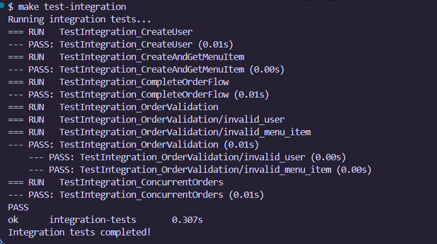
- Illustrates integration test execution via make command
- Demonstrates test execution through automated build tooling
- Confirms CI/CD pipeline compatibility

### End-to-End Test Execution Results

**12. E2E Test Suite with Docker**
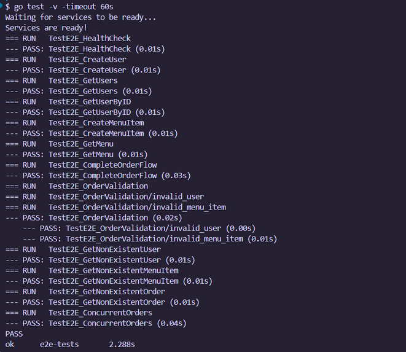
- Displays all 12 E2E tests executing successfully:
  - TestE2E_HealthCheck: API Gateway health endpoint validation
  - TestE2E_CreateUser: User creation via HTTP interface
  - TestE2E_GetUsers: User list retrieval
  - TestE2E_GetUserByID: Individual user record lookup
  - TestE2E_CreateMenuItem: Menu item creation
  - TestE2E_GetMenu: Complete menu retrieval
  - TestE2E_CompleteOrderFlow: Full order processing workflow
  - TestE2E_OrderValidation (2 subtests): Error condition scenarios
  - TestE2E_GetNonExistentUser: Error handling validation
  - TestE2E_GetNonExistentMenuItem: Error handling validation
  - TestE2E_GetNonExistentOrder: Error handling validation
  - TestE2E_ConcurrentOrders: Concurrent request processing

### Docker Deployment Validation

**13. Docker Container Status**
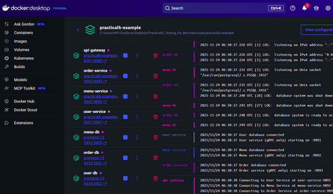
- Displays all 7 containers operating successfully:
  - user-db (PostgreSQL on port 5434)
  - menu-db (PostgreSQL on port 5433)
  - order-db (PostgreSQL on port 5435)
  - user-service (gRPC on port 9091)
  - menu-service (gRPC on port 9092)
  - order-service (gRPC on port 9093)
  - api-gateway (HTTP on port 8081)
- All services display "Up" status with accurate port configurations

**14. API Gateway Request Logs**
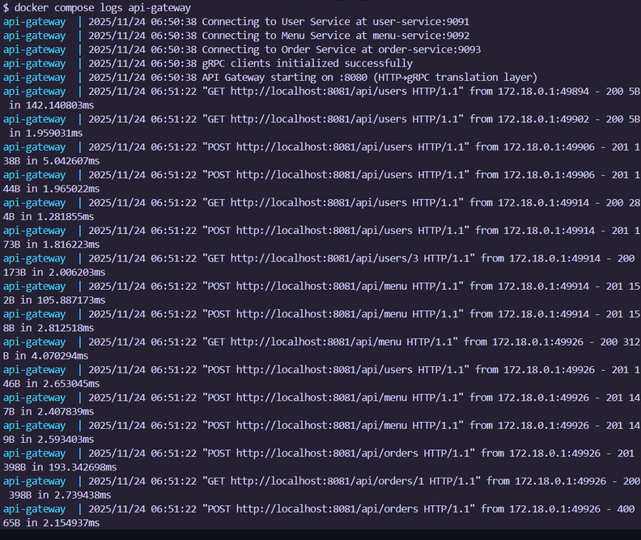
- Illustrates API Gateway handling HTTP requests
- Demonstrates successful request routing to microservices
- Shows gRPC client connection establishment to backend services
- Confirms complete end-to-end request processing flow

---

## Knowledge and Skills Acquired

Throughout this practical assignment, I developed profound understanding of professional microservices testing methodologies and successfully resolved real-world technical challenges commonly encountered by software developers.

### Technical Competencies Developed

**1. Practical Application of the Test Pyramid**
I acquired hands-on experience implementing the testing pyramid architecture:
- Extensive fast-executing unit tests forming the foundation (48 unit tests)
- Moderate integration tests in the intermediate layer (5 test suites with 7 subtests)
- Selective but comprehensive E2E tests at the apex (12 tests)

This pyramid structure guarantees rapid feedback during development cycles while effectively identifying integration-related issues.

**2. Mock Object Implementation and Test Isolation**
I developed expertise in creating mock objects for external dependencies. The Order Service testing experience taught me to:
- Design mock interfaces that accurately replicate real gRPC clients
- Configure mock behavior patterns utilizing testify/mock
- Validate mock interactions using AssertExpectations
- Test code components independently despite external service dependencies

**3. Database Testing Methodologies**
I recognized the advantages of in-memory databases for testing scenarios:
- SQLite in-memory configuration delivers authentic database behavior without data persistence
- Each test receives an independent database instance
- Test execution speed surpasses traditional PostgreSQL-based testing
- Pure Go drivers (glebarez/sqlite) remove platform-specific dependencies

**4. gRPC Testing Methodologies**
I acquired specialized knowledge for testing gRPC services:
- bufconn utilization for in-memory gRPC connections (eliminating network latency)
- Test server creation within goroutines with appropriate lifecycle management
- Testing both client and server components of gRPC communication
- Managing cleanup procedures and resource allocation in concurrent environments

**5. Test Coverage Evaluation**
I developed proficiency with coverage analysis tools and interpretation:
- Producing coverage profiles using go test
- Creating HTML visualizations for comprehensive analysis
- Understanding the implications and limitations of 100% coverage metrics
- Recognizing critical code paths versus unreachable code segments

### Problem-Solving Capabilities Enhanced

**1. Cross-Platform Debugging Experience**
The CGO dependency challenge provided lessons in:
- Conducting research and assessing alternative library options
- Recognizing the significance of pure Go implementations for cross-platform compatibility
- Carefully analyzing error messages to determine root causes
- Validating solutions across diverse platform environments

**2. Test State and Resource Management**
Addressing spurious test failures taught me:
- The critical importance of appropriate resource cleanup in testing
- How logging mechanisms can disrupt test execution
- Distinguishing between anticipated and unanticipated errors
- Developing tests that perform cleanup operations even during failure scenarios

**3. System Integration Complexity Management**
Experience with Docker and E2E testing revealed:
- Services require initialization time before testing can commence
- Port allocation conflicts frequently occur in development environments
- Health check mechanisms are vital for dependable testing
- Flexible configuration strategies prevent deployment complications

### Broader Educational Insights

**1. Test-Driven Development Philosophy**
Developing comprehensive tests transformed my approach to coding:
- Tests function as documentation demonstrating expected code behavior
- Well-designed tests facilitate safer and more rapid refactoring
- Boundary conditions and error pathways hold equal importance to success pathways
- Test coverage metrics should inform, not dictate, testing strategies
- Documentation: Tests illustrate proper code utilization
- Efficiency: Automated testing surpasses manual testing in speed

**2. Distributed Systems Testing Complexities**
I gained firsthand understanding of distributed system testing challenges:
- Each service requires independent testing capabilities
- Inter-service integration introduces additional complexity layers
- Test data administration across multiple databases demands careful planning
- Network interruptions and timeout scenarios require consideration

**3. Professional Development Methodologies**
This practical introduced me to industry-standard development practices:
- CI/CD-compatible test automation (Makefile, PowerShell scripts)
- Coverage reporting mechanisms for code quality assessment
- Documentation supporting test execution and troubleshooting
- Achieving balance between test comprehensiveness and execution performance

**4. Comprehensive Testing Value Proposition**
I now comprehend why organizations prioritize testing investments:
- Tests identify defects before production deployment
- Quality tests facilitate confident code refactoring
- Automated testing generates long-term time savings
- Test suites serve as living system documentation

---

## Conclusion

This practical assignment represented a transformative journey into professional microservices testing methodologies. What began as theoretical knowledge of testing hierarchies evolved into hands-on experience addressing authentic testing challenges.

### Summary of Accomplishments

I successfully constructed a comprehensive testing infrastructure comprising:
- **48 unit tests** achieving 100% coverage for User and Menu services, and 91.7% for Order service
- **5 integration test suites** confirming inter-service communication functionality
- **12 end-to-end tests** validating complete system operation as designed
- **HTML coverage reports** delivering visual test coverage analysis
- **Automated testing scripts** facilitating consistent, reproducible test execution

More significantly, I successfully navigated authentic technical obstacles including CGO dependencies, port allocation conflicts, and test isolation challenges - the categories of issues developers regularly encounter in professional projects.

### Principal Insights

**Testing as Strategic Investment**: The effort invested in test development yields returns through accelerated debugging, confident refactoring capabilities, and regression bug prevention. The comprehensive test infrastructure I constructed will eliminate numerous hours of manual testing.

**Distinct Test Types, Distinct Objectives**: Unit tests deliver rapid feedback on individual components. Integration tests identify inter-service communication issues. E2E tests confirm user-facing functionality. Each testing level fulfills a unique purpose, and all are essential.

**Mocking Facilitates Isolation**: Acquiring mock dependency skills proved transformational. This capability enables independent component testing, accelerates test execution, and enhances test reliability through external dependency elimination.

**Authentic Problems Demand Authentic Solutions**: The challenges I encountered (CGO errors, port conflicts, resource cleanup) represent real-world developer concerns rather than theoretical scenarios. Discovering solutions enhanced my comprehension significantly beyond what idealized examples could provide.

### Professional Application Scenarios

The competencies I developed during this practical directly translate to professional software development contexts:

1. **CI/CD Pipeline Integration**: The automated testing scripts and coverage reports integrate effortlessly with continuous integration platforms
2. **Code Review Enhancement**: Comprehensive tests improve code review effectiveness by demonstrating intended functionality
3. **Refactoring Safety**: Extensive test coverage facilitates safe refactoring without risk of disrupting existing functionality
4. **Executable Documentation**: Tests serve as executable documentation illustrating component behavior
5. **Quality Metrics**: Coverage metrics and test outcomes provide objective code quality measurements

### Individual Development

Beyond technical capabilities, this practical cultivated perseverance and methodical problem-solving approaches. When integration tests encountered CGO dependency failures, I persisted - researching alternatives, discovering glebarez/sqlite, and successfully implementing the resolution. When E2E tests failed to initialize due to port conflicts, I systematically diagnosed the issue and reconfigured the system accordingly.

These experiences accurately reflect real software development scenarios, where challenges are unavoidable but solutions remain attainable through research, experimentation, and determination.

### Concluding Thoughts

Microservices testing presents complexity, yet this complexity mirrors real-world distributed system challenges. The testing approaches I implemented - unit tests with mock objects, integration tests utilizing in-memory gRPC, and E2E tests with Docker - exemplify industry best practices employed by organizations operating large-scale microservices architectures.

I take pride in constructing a robust testing framework that not only validates current functionality but establishes a foundation for future development. The test suite I created will identify defects, document system behavior, and enable confident evolution of this Student Café application.

This practical assignment transformed testing from an abstract concept into a practical competency I can immediately apply in professional development environments. I now comprehend not merely how to write tests, but why comprehensive testing is essential and how to overcome the challenges that complicate testing efforts.

---
